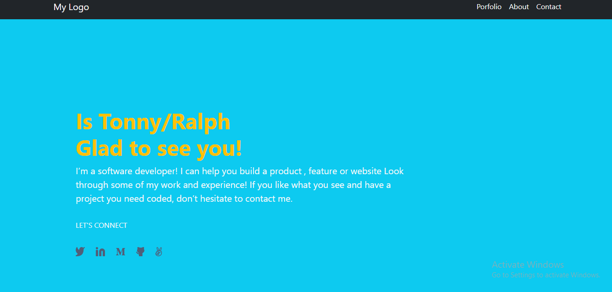

# Portfolio-Bootstrap

> Welcome to my Portfolio 

- Live version: [GitHub Page](https://github.com/tonnymuchui/Portfolio-bootstrap)
#### View Portfolio Image.

## Built With

- HTML,CSS& Bootstrap

## Getting Started

To get a local copy up and running follow these simple example steps.

### Prerequisites
- code editor
### Setup
-clone a copy of this project from 
### Install
- open this project on your code editor and run liveserver
### Usage

### Run tests

### Deployment

## Authors

👤 **Author1**

- GitHub: [@githubhandle](https://github.com/tonnymuchui/Portfolio.git)
- LinkedIn: [LinkedIn](https://www.linkedin.com/in/tonny-muchui-murungi-9b549a174/)

👤 **Author2**
 Ekpenisi Erue Raphael.
- GitHub: (https://github.com/eerapheal) 
- Twitter: (https://twitter.com/ekpenisiraphael) 
- LinkedIn: (https://www.linkedin.com/in/ekpenisi-e-raphael-9678a221a/)

## 🤝 Contributing

Contributions, issues, and feature requests are welcome!

Feel free to check the [issues page](../../issues/).

## Show your support

Give a ⭐️ if you like this project!

## Acknowledgments

- Hat tip to anyone whose code was used
- Inspiration
- etc

## 📝 License

This project is [MIT](./LICENSE) licensed.